# Data analyst : cv-resume

## A propos

Je suis une Data analyst avec une solide expérience en communication et marketing dans le domaine de la santé.

Polyvalente et curieuse, je m'active à donner du sens aux données, les rendre accessibles et pertinentes pour éclairer les décisions de manière concrète et efficace. 

Je vous invite à découvrir mon parcours et les projets accomplis ci-dessous. 
Pour apprécier mon **portfolio data** plus en détails c'est [par ici](https://CandicePlainfo.github.io)

## 🔗 Me suivre | Me contacter
[LinkedIn](https://www.linkedin.com/candice-plainfosse-92853660)
[Bluesky social](https://bsky.app/profile/candiceplainfo.bsky.social)

## Compétences professionnelles
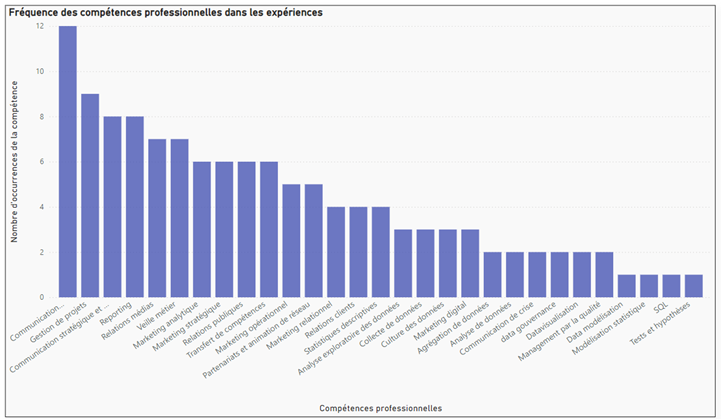

## 🛠 Compétences techniques
- Languages : , Python, SQL, R, Dax
- Outils : Jupyter, MySQL, Rstudio, MS 365, Power BI, Knime, Git & Github, Power Query, SQLite, SQL Power Architects, Canva, Sharepoint

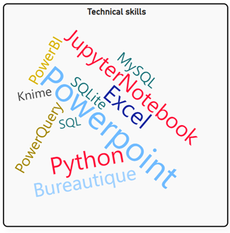

## Soft skills
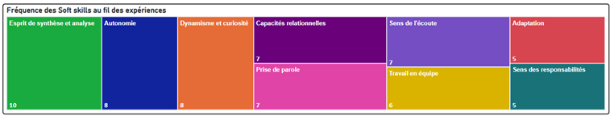

## Education & formation

### Data analyst, OpenClassrooms et ENSAE
#### 2024 | A distance

Explorer, analyser et exploiter des données pour aider à la prise de décision en entreprise

Les missions types réalisées :

- Réaliser des modélisations de données pour segmenter une audience marketing ; 
- Analyser les ventes en vue d'améliorer la stratégie de l'entreprise ; 
- Interroger une base de données statistiques pour répondre à des questions business ; 
- Réaliser des dashboards avec graphiques et indicateurs de suivi pour suivre et analyser des résultats ;
- Collecter, agréger et nettoyer des données en vue de réaliser une étude de marché.
- Utiliser des modèles d'apprentissage (supervisé et non supervisé) pour réaliser des prédictions.

Technologies et langages utilisés :
Python, Jupyter, R, Rstudio, MySQL, SQL, Knime, PowerBI, Pandas, Numpy, Matplotlib, Seaborn, Statsmodel, Scikitlearn.

### Pass Management Financier, EM Normandie
#### 2019 | Caen ; France

### Master of Arts in International Communication, Macquarie University
#### 2002 | Sydney NSW ; Australie

**Thématiques principales** :
Intercultural communication, information campaigns, marketing, political economy, public relations, marketing, global medias

### Diplôme d'Études Politiques, Sciences Po Lyon
#### 1999 - 2001 | Lyon ; France

Spécialité : Affaires et relations internationales
Certification complémentaire : Diplôme d'Université du monde arabe contemporain

[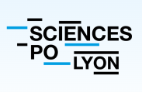](https://www.sciencespo-lyon.fr/)

## Expériences professionnelles

### Directrice de la communication Hauts-de-France et Normandie, Etablissement français du sang (EFS)
#### 2017 - 2023 | Caen, Lille, Rouen ; France

Missions principales :
 • **Stratégie de communication** (et budget associé) à 360° au service de l'établissement interrégional dans tous les domaines de communication interne, institutionnelle, presse, marketing don et marque donneurs (programme Innovadon de modernisation de l'expérience donneurs) dans une logique de cohérence nationale et locale.
 • **Management** hiérarchique des équipes et management fonctionnel; management par la qualité (auditeur interne norme iso), accompagnement au changement.
 • **Animation du réseau** des partenaires associatifs pour le don de sang bénévole (400 assos, 10 unions départementales et 3 comités régionaux sur le territoire Hauts-de-France et Normandie).
 • Communication de crise (anticipation et gestion) 
 • **Communication 360°** sur le don et la marque donneurs : contribuer à la fréquentation des 4000 collectes de sang par an et des 9 maisons du don du territoire des Hauts-de-France et de la Normandie en prenant en compte les attentes de toutes les parties prenantes (partenaires, 400 000 donneurs par an, acteurs internes, etc.) : marketing opérationnel, digital, analytique et relationnel.

[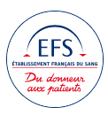](https://www.efs.sante.fr/lefs-en-hauts-de-france-et-normandie)

### Responsable communication Normandie, Etablissement français du sang (EFS)
#### 2008 - 2016 | Caen, Rouen ; France

**Communication & marketing** : 
- Communication stratégique & opérationnelle : concevoir, piloter et évaluer le plan de communication régional par objectif et par cible (interne, externe don, institutionnelle) et son budget associé, dans le respect des axes stratégiques nationaux. 
- Communication orale & écrite : rédiger par cible et pour tous supports & tous canaux; former et animer; intervenir en communication pédagogique; prendre la parole dans les médias. 
- Relations médias régionaux (off et on-line) : élaborer des dispositifs médias 360°, assurer la veille 
médiatique, construire et actualiser un fichier presse, produire des rédactionnels, réaliser un panorama presse mensuel. 
- Gestion de la cellule régionale d’écoute « clients »
**Management & organisation** : 
- Management de service selon les principes suivants : transparence, professionnalisme, exemplarité. 
- Gestion de projet (concevoir, suivre, évaluer) : événementiel et accompagnement du changement de l'organisation. 
- Management par la qualité
**Animation de réseau** : 
- Former & informer le réseau des bénévoles du don (100 associations) et des correspondants locaux de promotion du don.  
- Gérer des partenariats : initier, déployer et suivre les conventions de partenariat 
**Participation à des travaux de recherches**
- Collaboration de recherche scientifique en psychologie sociale avec le laboratoire NIMEC puis LPCN de l’Université de Caen Normandie.

[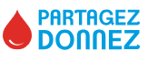](https://dondesang.efs.sante.fr/)

### Chargée de communication Normandie, Etablissement français du sang (EFS)
#### 2005 - 2007 | Caen, Rouen ; France

**Missions principales** : 
- Assurer le marketing et la communication sur le don de sang, de plasma et de plaquettes dans tous leurs aspects afin de contribuer à la fréquentation des lieux de dons de sang de la région Normandie (7 maisons du don et 1500 collectes mobiles pour 150 000 dons collectés par an et autant de donneurs accueillis dans la région).
_L'enjeu repose sur le recrutement de nouveaux donneurs en continu et à la fidélisation des donneurs afin qu'ils deviennent réguliers._
- Mes actions touchaient les domaines du marketing stratégique, relationnel, analytique et opérationnel ainsi que la communication écrite et orale, stratégique et événementielle, partenariats et animation du réseau des bénévoles pour le don de sang (une centaine d'associations de terrain).

### Attachée de presse et de relations publiques, Agence Michèle Frêné Conseil
#### 2003 - 2004 | Caen ; France

- Communication écrite et orale
- Gestion de projets
- Relations clients
- Relations médias
- Relations publiques et événementielles

## Projets data

### Étude de marché pour l'export en agroalimentaire
Analyse complète depuis la collecte des données, leur nettoyage jusqu'à une analyse via réduction des dimensions et clustering, jusqu'aux recommandations business

Technologies et langages : Python, Jupyter notebook, ACP, Clustering

[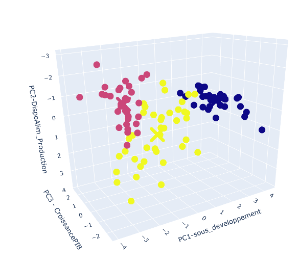](https://github.com/CandicePlainfo/etude_marche_export)

### Reporting de gestion d'un portefeuille Projets
Dataviz avec Power BI pour un reporting sur le suivi de projets

Technologies et langages : Power Query Editor, Power BI

[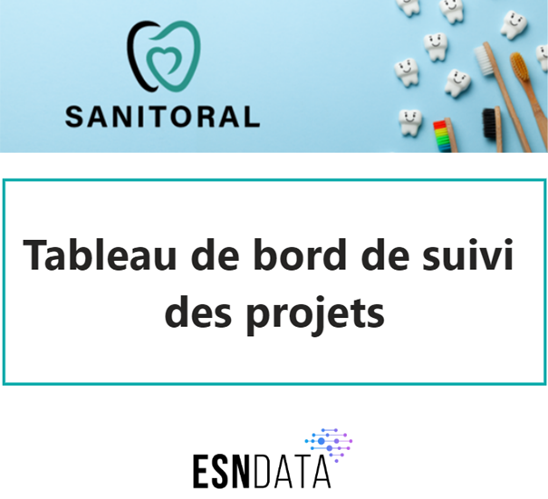](https://github.com/CandicePlainfo/reporting_gestion_de_projets)

### Création d'un modèle de prédiction de l'authenticité des billets 
Elaboration d'un modèle d'apprentissage pour réaliser une prédiction sur l'authenticité des billets

Technologies et langages : Python, Jupyter notebook, modèles d'apprentissage supervisés et non supervisés

[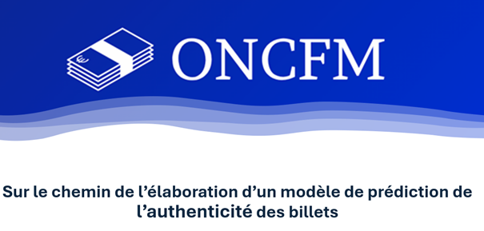](https://github.com/CandicePlainfo/modele_authenticite_billets)

### Création et gestion d'une base de données SQL
Création de bases de données, vérification de leur intégrité et techniques de requêtage SQL sur des données immobilières

Technologies et langages : SQL, MySQL, SQL Power Architects

[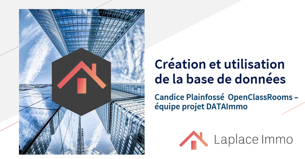]([https://github.com/CandicePlainfo/creation-gestion_BDD_SQL)

### Optimiser la gestion d'une boutique en ligne
Prétraitement de données, analyses univariées et multivariées des données d'une boutique de spiritueux en ligne.

Technologies et langages : Python, Jupyter notebook

[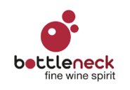](https://github.com/CandicePlainfo/optimiser_gestion_boutiqueenligne)

### Elaboration des indicateurs EgaPro 
Élaboration d'un workflow Knime pour l'automatisation du calcul des indicateurs annuels d'égalité professionnelle

Technologies et langages : Knime

## Formations continues

- Auditeur interne (norme iso 9001), EFS
- Gestion de projet (cascade et agile), LCA
- Prise de parole publique, Verbatim 
- Outils et méthodes en promotion et éducation à la santé , EHESP
- Sauveteur et secouriste du travail

## Autres activités

⚡️ **Fun fact 1...**
Je suis également professionnelle en Shiatsu, une technique manuelle de massage d'origine japonaise à base de pressions ciblées et rythmées sur le corps qui apporte bien-être et vise à l'accompagnement du maintien de la santé. 

⚡️ **Fun fact 2...**
Et j'enseigne le Viet Vo Dao, un art martial traditionnel vietnamien, aux jeunes depuis de nombreuses années au sein de l'[Association Vovinam Viet Vo Dao Caen](https://www.instagram.com/vovinamvietvodaocaen/) car je suis titulaire du Brevet d'État d'éducateur sportif (tronc commun).

